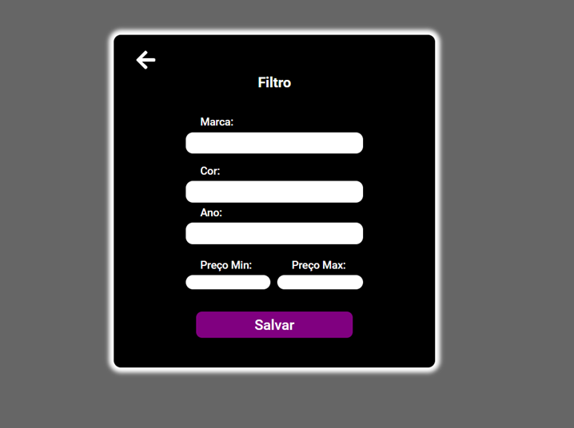
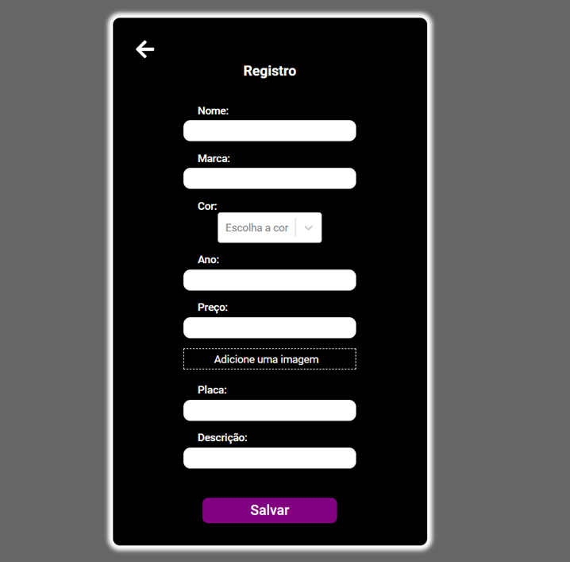
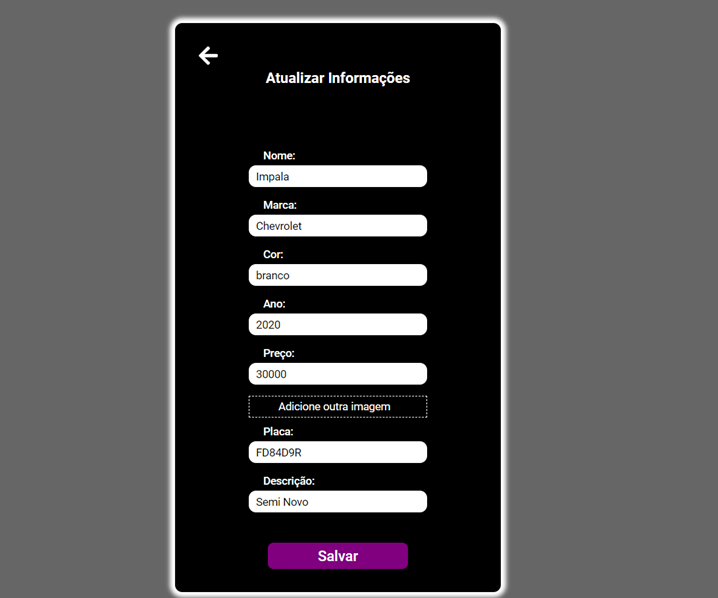

<h1>Corelab challenge</h1>

Filter Page

Register Page

Register Page

<h2>project's goal</h2> 

The main goal of the project is the CRUD of the vehicles. Create/Read/Update/Delete

<h2>Project Description</h2>

<ul>
<li>Project made from Javascript, React.js with StyledComponents </li>

<li>To create the forms we used the react hook form together with Yup for data validation</li>

<li>To have more control over the application's routes the dom react router was used </li>

<li>Used Context API to share "global" data for the entire application</li>

<li>Used LocalStorage for bookmark functionality</li>

<li>Used the API that I developed myself.</li>

<li>Various components created for greater code organization</li>

<li>Eslint and Prettier were used to standardize and organize the code</li>

<li>Extensive use of Filter and Map for input functions and Filter form</li>

</ul>

<h2>project features</h2> 

<ul>

<li>When you click the "Add New Vehicle" button, a new form opens to create a vehicle.</li>

<li>When you submit the form, the new vehicle is saved. </li>

<li>By typing something into the Search Input, the vehicles are filtered by comparing whatever the ownership of the vehicle is. For example: the search term is compared with the name, or the description, or the price, or any other field of the vehicle.</li>

<li>By clicking on a heart icon, the vehicle is favorited. </li>

<li>Clicking an edit icon opens the form for the selected vehicle again to edit it.</li>

<li>Clicking a delete button removes the vehicle. </li>

<li>Clicking on the filter button opens a filter form, and when the filters are selected, it filters the vehicles based on the values. </li>

<li>The cards are background color based on the color of the vehicle (e.g. white vehicle, card is white).</li>

<li>It is also possible to place or change an image of the vehicle when creating and editing the car.</li>

</ul>

<h2>🤝 Collaborator </h2> 
<table>
  <tr>
    <td align="center">
      <a href="#">
      
       
        
          <b>Diogo Luis</b>
        
      </a>
    </td>
  </tr>
</table>

<h2> 👨‍💻 Technologies </h2>

Technologies used in this project:

 

